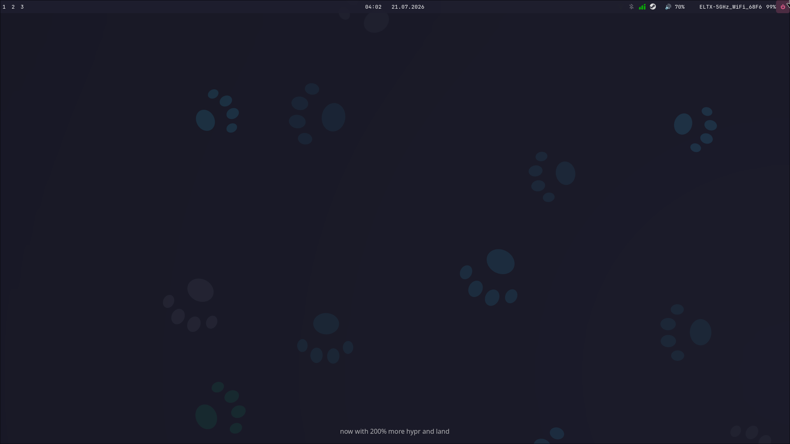

# my_simple_hyprpaw
# my_simple_hyprpaw

Простой, но не голый дотфайл-конфиг для Hyprland на Arch Linux: тайловый WM
+ панель + лаунчер + экран блокировки + меню выхода, с автоустановкой всех
зависимостей на новой машине одной командой.


## Что входит в стек

| Компонент | Роль |
|---|---|
| **Hyprland** | сам композитор/оконный менеджер (конфиг — `hyprland.lua`, на Lua, начиная с Hyprland 0.55) |
| **Waybar** | верхняя панель: рабочие столы, часы со встроенным календарём, трей, звук, сеть, кнопка выхода |
| **Wofi** | лаунчер приложений (`SUPER + D`) |
| **Wlogout** | графическое меню выхода (lock/logout/suspend/reboot/shutdown) |
| **Hyprlock** | экран блокировки |
| **Hypridle** | демон простоя: гасит экран, блокирует, уводит в сон по таймауту |
| **Dolphin / Kate / Konsole** | файловый менеджер, текстовый редактор, терминал — забинжены на хоткеи |
| **grim + slurp** | скриншоты (всего экрана и произвольной области) |
| **cliphist + wl-clipboard** | история буфера обмена |
| **playerctl** | проверка медиа, используется, чтобы не гасить/не блокировать экран во время просмотра видео или музыки |
| **network-manager-applet, blueman** | иконки сети и Bluetooth в трее + их GUI-настройки |
| **wireplumber, pavucontrol** | управление громкостью (хоткеи) и графический микшер звука |
| **polkit-kde-agent, xdg-desktop-portal(-hyprland)** | системные диалоги авторизации и общесистемные Wayland-порталы (шаринг экрана, выбор файлов и т.п.) |
| **wlogout** ⚠️ | ставится отдельно из **AUR** — в официальных репозиториях Arch его нет |
|**brightnessctl**| 
Плюс личные приложения из автозапуска (Firefox, Telegram, Steam, Hiddify VPN) —
их `install.sh` не ставит, это дело вкуса каждого конкретного пользователя, можно изменить в конфиге `hyprland.lua`.

## Особенности конфига

- **Мониторы** определяются автоматически — лучшее разрешение и частота
  обновления по EDID, раскладка по порядку. Работает на любом ПК без правок.
- **Видеокарта** определяется автоматически по PCI vendor ID
  (`/sys/class/drm`) — на NVIDIA подставляются нужные переменные и костыли
  (`no_hardware_cursors`, `force_zero_scaling`), на AMD/Intel — нет.
- **Простой/блокировка/сон** — трёхступенчато через Hypridle: выключение
  экрана → блокировка → сон, но оба первых шага **ждут окончания медиа**
  (проверка через `playerctl`), чтобы не гасить экран во время просмотра
  видео или прослушивания музыки.
- **Плавающие окна центрируются** при открытии — диалоги выбора файла,
  всплывающие окна Steam и т.п. больше не прилипают к краю экрана.
- **Шрифт** — везде (панель, лаунчер, экран блокировки, терминал) единый
  JetBrains Mono с полной поддержкой кириллицы.

## Хоткеи

`SUPER` = клавиша Win.


**Приложения**

| Комбинация | Действие |
|---|---|
| `SUPER + /` | Шпаргалка по хоткеям |
| `CTRL + ALT + T` | Терминал (Konsole) |
| `SUPER + E` | Файловый менеджер (Dolphin) |
| `SUPER + C` | Текстовый редактор (Kate) |
| `SUPER + B` | Браузер (Firefox) |
| `SUPER + D` | Лаунчер приложений (Wofi) |


**Окна и рабочие столы**

| Комбинация | Действие |
|---|---|
| `ALT + F4` | Закрыть окно |
| `SUPER + Space` | Плавающее/тайловое окно (toggle) |
| `SUPER + ←/→/↑/↓` | Фокус на соседнее окно |
| `SUPER + 1..4` | Переключиться на рабочий стол |
| `SUPER + SHIFT + 1..4` | Перенести окно на рабочий стол |
| `SUPER + SHIFT + ←/→/↑/↓` | Перенести окно на монитор в этом направлении |
| `SUPER + ЛКМ (зажать)` | Перетаскивание окна мышью |
| `SUPER + ПКМ (зажать)` | Изменение размера окна мышью |

**Скриншоты и система**

| Комбинация | Действие |
|---|---|
| `Print` | Скриншот области → буфер обмена |
| `SHIFT + Print` | Скриншот всего экрана → файл |
| `SUPER + Escape` | Меню выхода (Wlogout) |
| `SUPER + SHIFT + M` | Выйти из Hyprland |
| Клавиши громкости | Регулировка звука (работают даже когда сессия заблокирована) |

## Установка на новую машину

```bash
git clone /my_simple_hyprpaw
cd ~/my_simple_hyprpaw
./install.sh
```

Скрипт ставит зависимости через `pacman` (+ `wlogout` отдельно из AUR через
`yay`/`paru`/`aura`), копирует конфиги в `~/.config` с бэкапом того, что было
раньше, выставляет права на скрипты и ставит профиль шрифта для Konsole.
На дистрибутивах без `pacman` часть шагов потребует ручной установки —
скрипт предупредит и подскажет, что делать.

После установки — перелогиньтесь в сессию Hyprland.
